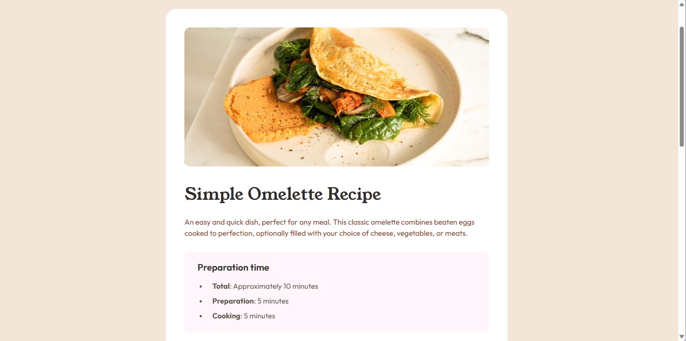

# Frontend Mentor - Recipe page solution

This is a solution to the [Recipe page challenge on Frontend Mentor](https://www.frontendmentor.io/challenges/recipe-page-KiTsR8QQKm). Frontend Mentor challenges help you improve your coding skills by building realistic projects. 

### Screenshot

### Links

- Solution URL: [https://github.com/Alexandru-Enescu/recipe-page](https://github.com/Alexandru-Enescu/recipe-page)
- Live Site URL: [https://alexandru-enescu.github.io/recipe-page/](https://alexandru-enescu.github.io/recipe-page/)

### Built with

- Tailwind
- Flexbox
- Mobile-first workflow

## Author

- Frontend Mentor - [@Alexandru-Enescu](https://www.frontendmentor.io/profile/Alexandru-Enescu)
- GitHub - [@Alexandru-Enescu](https://github.com/Alexandru-Enescu)
